# The 'Perfect' Neighborhood
## A. Introduction
### A1. Background
Finding the 'perfect' neighborhood is not an easy job for most of us. Sometime we know what we want out of a good neighborhood, but most of the time we just love the place without really knowing why we love it so much. As a common folk, this might not be a problem but for a real estate agent who have to face their client and giving the 'best' recommendation this wasn't an easy task. In this project we will explore how a problem like this can be tackled with data science by utilizing all the available data from the internet and neighborhood information from Foursquare API.
### A2. Problem Definition
A client whose currently live in Little Saigon, San Fransisco, CA will move to Seattle, WA within a couple of months. He want to find a house with a similar neighborhood there, he explain some category for the 'perfect' neighborhood that he had in mind such as school for his kids, access to city park but he could't point out what he love the most about his current neighborhood. He just simply love it.
### A3. Data Description
In order to solve his client problem, we need access to a couple of data:
* List of the [neighborhoods in San Fransisco](https://en.wikipedia.org/wiki/List_of_neighborhoods_in_San_Francisco)
* List of the [neighborhoods in Seattle](https://en.wikipedia.org/wiki/List_of_neighborhoods_in_Seattle)
* Venues information from Foursquare API for each neighborhood

## B. Methodology
In this project, I use GitHub to store all data related to my project including _Jupyter Notebook_ I wrote. To find the best neighborhood for my client, I need to know what his current neighborhood looks like. Not in an abstract point of view but more into a factual idea of how the neighborhood looks like by first finding a similarity in other neighborhood within San Fransisco area.
### B1. Data Scraping
The information provided about San Fransisco neighborhood in Wikipedia aren't presented in tabular, so I need to scrap the website by looking at it structure and use `BeautifulSoup` module to parse the 'html' file for my purpose. This step will also be done for the neighborhood data for Seattle.
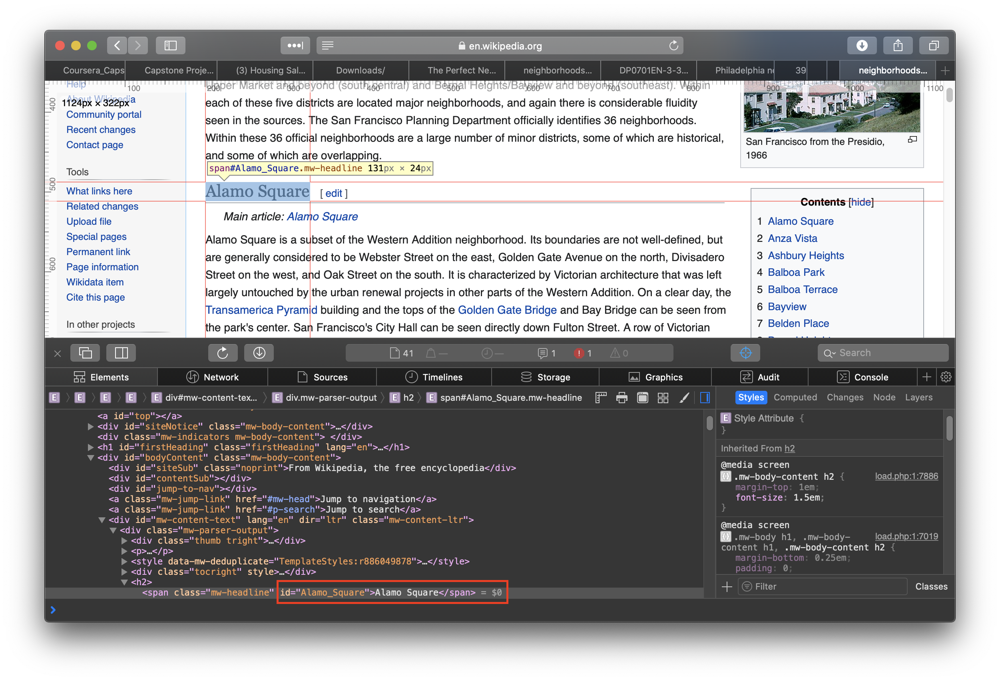
In the above picture, we can see that each neighborhood presented under `mw-headline` class with the text value is the neighborhood name. Using `BeatuifulSoup` we can easily get all the neighborhood list and put it into a panda dataframe.
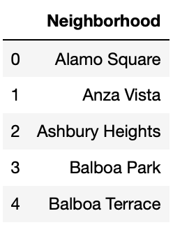
### B2. Assigning Geolocation Data
For my next step in analyzing the neighborhood using **FoursquareAPI** I will need each neighborhood geolocation data. To get geolocation data for each neighborhood I used [OpenCageGeocode](https://opencagedata.com/) library that can provide forward/reverse geocoding. To get access to the _OpenCageGeocode_ API we can just simply sign up and use the free account with limited 2500 request/day, which will be more than enough for our project.
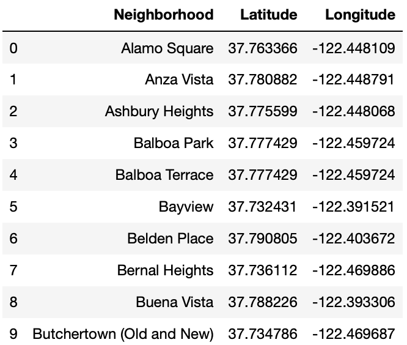
With the location data availbale we could visualize the neighborhoods in a map. In this project I used `Folium` map to visualize all the data in this project. Visualizing the data can be helpful, especially when we're trying to see if we had the right geolocation data.
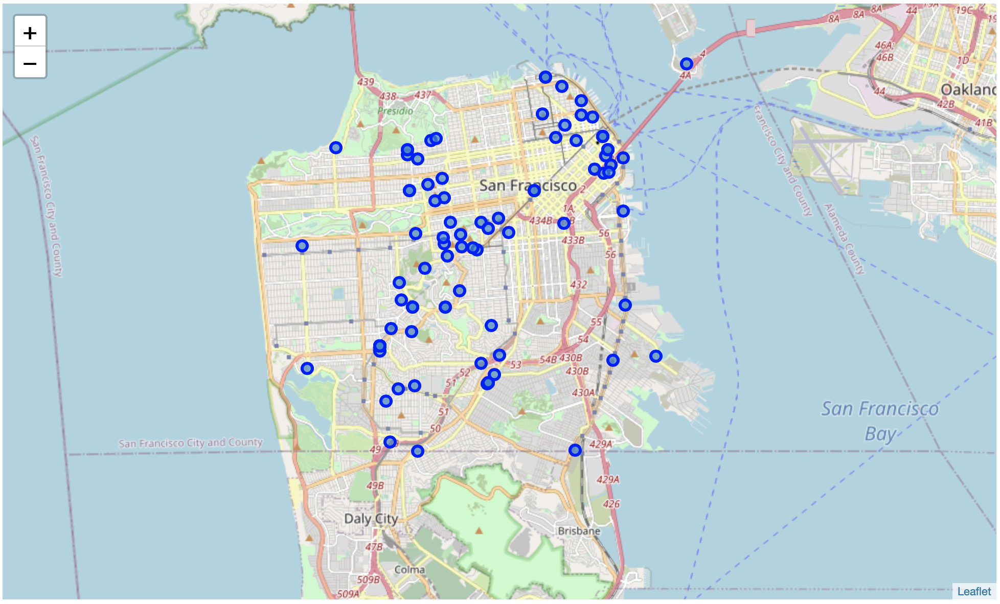
### B3. Examine the Current Neighborhood
**FoursquareAPI** can give us access to the information of nearby venues from a location by providing the geolocation (latitude & longitude). In this project I used **FoursquareAPI** to return a maximum of 100 venues within 500 m radius from each neighborhood. This image shows the dataframe created with returned venues from **FoursquareAPI** within Alamo Square neighborhood. In total there are 312 unique venues returned by **FoursquareAPI** within the 119 neighborhood of San Fransisco. 
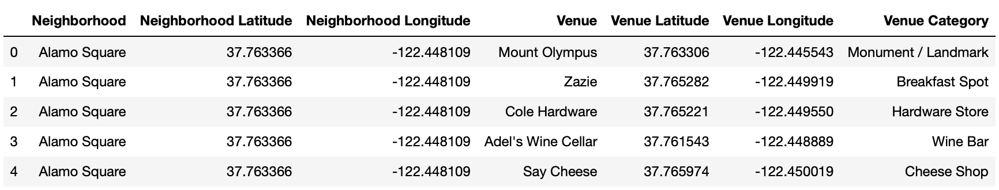
To analyze each neighborhood, I uses onehot encoding (giving value of 1 for `True` and 0 for `False`) for each venue category and use it to create mean value of the venue category for each neighborhood. This mean value will be used to rank the most common venue in each neighborhood. For the next step of clustering the neighborhood I created a new dataframe with ten most common venues for each neighborhood
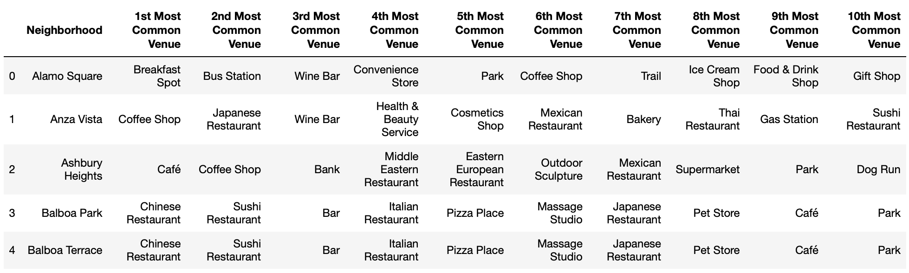
### B4. Neighborhood Clustering
Analyzing the current neighborhood (Little Saigon) alone will not give enough pattern to identify what is the most important part of the neighborhood. In this case, I used k-means clustering techniques to find similar neighborhood within San Fransisco area. The clustering was carried on the the new dataframe with 10 most common venue being presented for each neighborhood. 
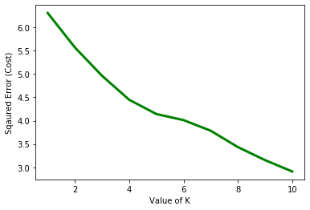
With the data that I had, it's not easy to get the right k even after looking at the elbow plot with a higher number of iteration it wasn't able to find a good convergence (above image). A Density-Based Clustering (DBSCN) might be able to get better result, but for this project I decided to go with k-means because after several trial on the k values, Little Saigon always fall into the same cluster. Since I just need to know what is the 1st-3rd most common venues available within the same cluster with Little Saigon, this will be enough to fulfill my objective.
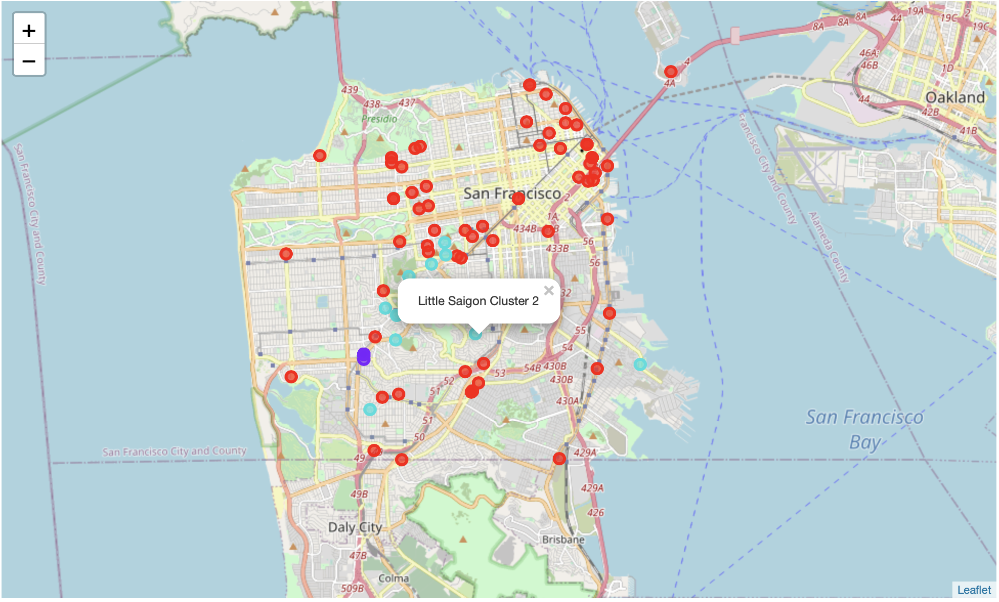
The map shows all the neighborhood colored with different cluster label, it shows that Little Saigon fall under cluster 2. Knowing which cluster it belongs to, the next step is to find the 1st-3rd most common venue. Why the 1st-3rd? simple answer, it must be the most well-known venue of the neighborhood and people who just love the neighborhood must have interaction with the venue in daily basis.
I took the new dataframe with cluster label, filter it to cluster 2 data only and created bar chart for the 1st-3rd most common venue by plotting the unique venue category vs the count of each venue category presented in cluster 2.
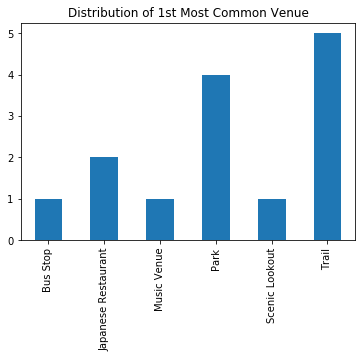
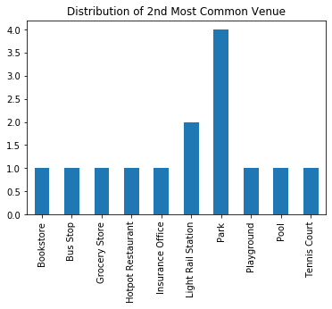
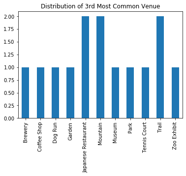
### B5. Applying the Same Method to Seattle Data
With the data handling for the San Fransisco is done, I continue to follow the same methology to analyze the Seattle data. Each step from parsing the data to the clustering method was carried out to the Seattle data with the only difference is the last step. From the step that I've done with San Fransisco data, I now have the knowledge of the most commone venue for Little Saigon which I will be using to find the 'perfect' neighborhood in Seattle.
#### Seattle Dataframe
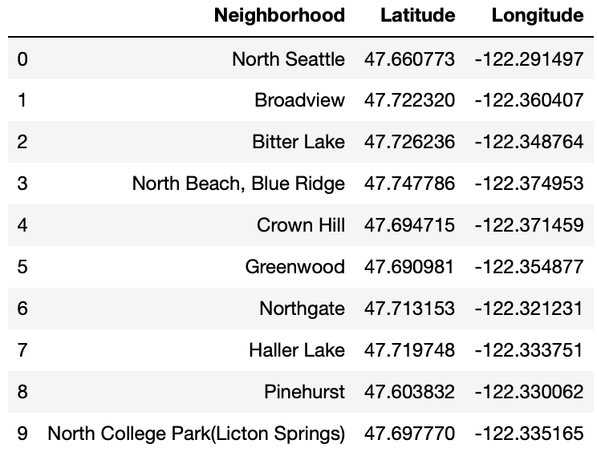
#### Seattle Neighborhood Map
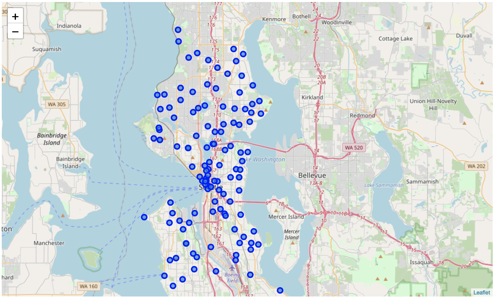
#### Seattle Venue
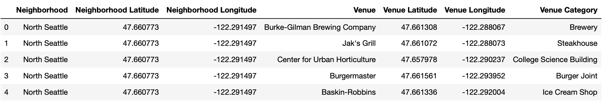
## C. Result & Discussion
Analyzing the whole neighborhood in San Fransisco and applied clustering able to help understanding the current neighborhoods in Little Saigon. Narrowed down to the cluster where Little Saigon belonged to and analyzing the most common venues distribution in the cluster, I can identify what is the most visible venues in the neighborhood, which is Park/Trail. Little Saigon neighborhoods have a lot of venue which can be used as a recreational area which is the reason why it is lovable neighborhood.
Moving out to Seattle, after the same analysis was carried on Seattle data finding the 'perfect' neighborhood which match what Little Saigon have is very straight forward. I can find the list of neighborhood by locating the neighborhood with _Park/Trail_ as the **1st Most Common Venue**.
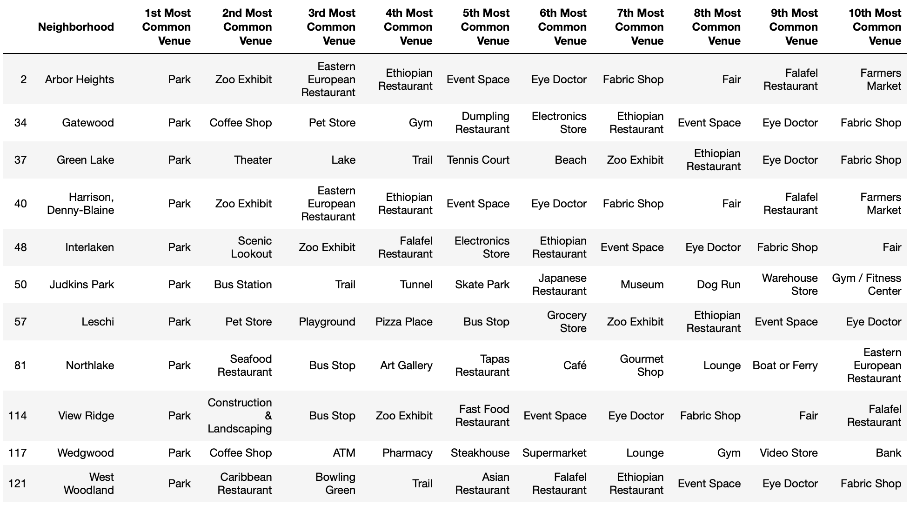
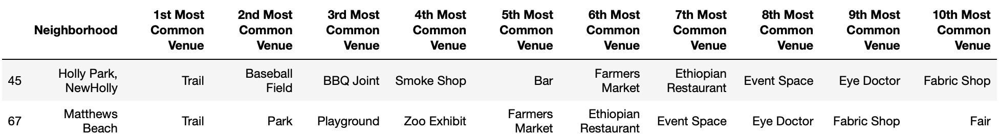
The above list gave some of the possible 'perfect' neighborhood for my client, but what about the overall living experience in Seattle as compared to San Fransisco? will it be so much different?
To answer the question and give a bird eye view of how similar is Seattle compared to San Fransisco, we could take a look at the distribution of the **1-10th Most Common Venue** in each city.
#### 1st Most Common Venue Distribution in San Fransisco
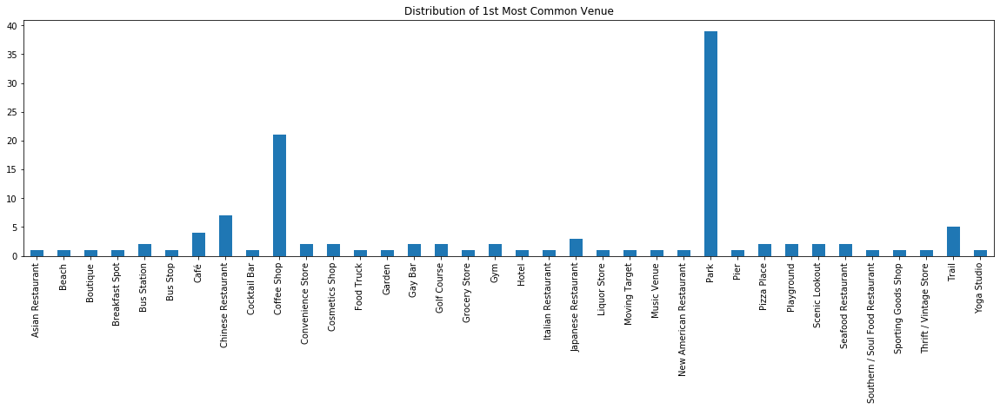
#### 1st Most Common Venue Distribution in Seattle
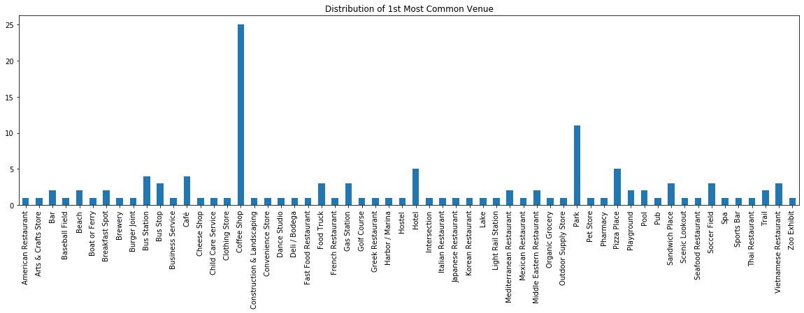
From the above distribution, the most prominent feature of both city are _Coffee Shop_ and _Park_. In term of venues distribution both Seattle and San Fransisco are pretty much similar, which means the living experience will be pretty much the same if we rely on the similar activity that can be done in both city.
## D. Conclusions
Both Seattle and San Fransisco are similar in every way, both city has large recreational area offering such as _Park/Trail_ and a bunch of _Coffee Shop_ in the area. Moving from Little Saigon, San Fransisco to a similar neighborhood in Seattle wouldn't be a problem, given the same living experience can be provided in Seattle.